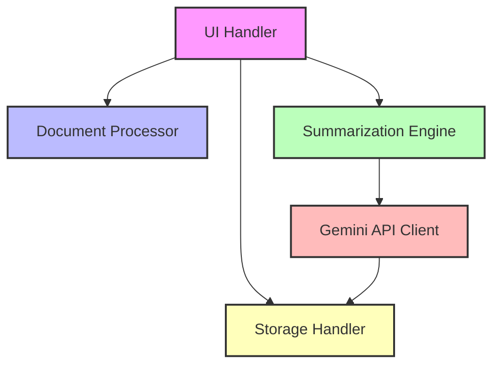
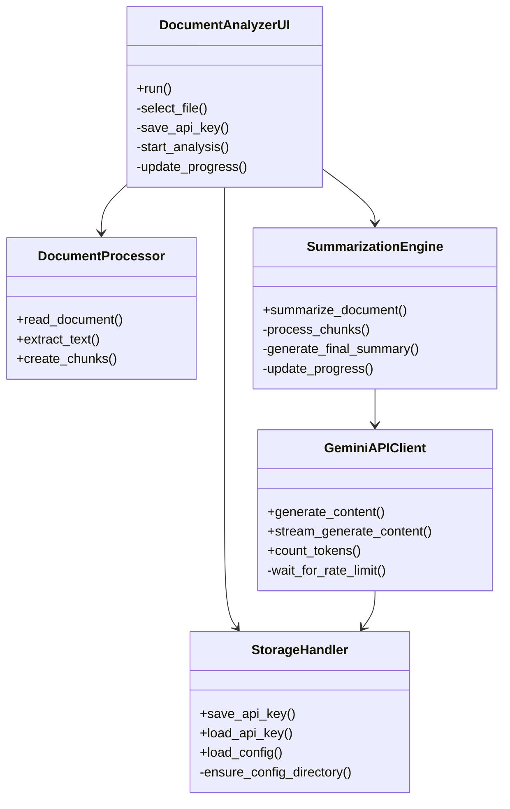
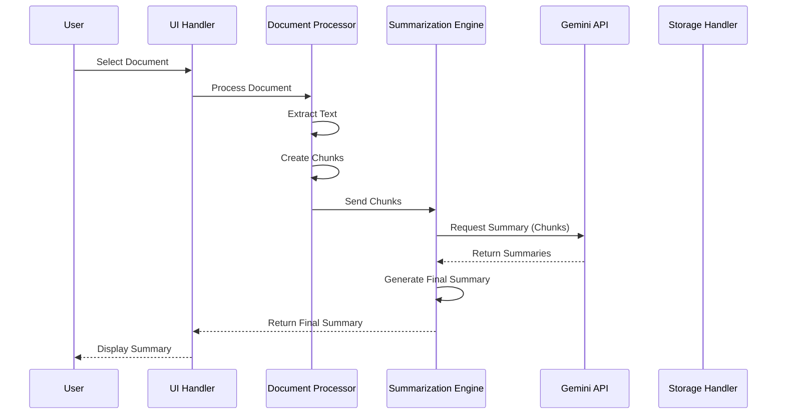
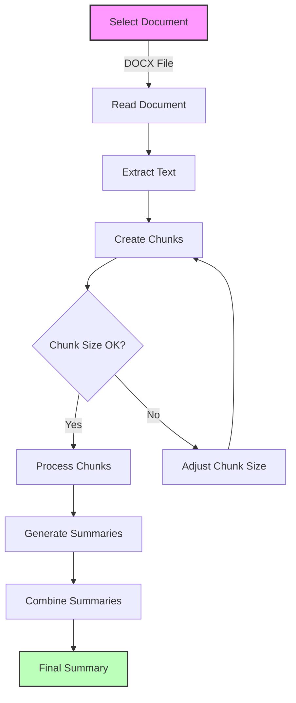
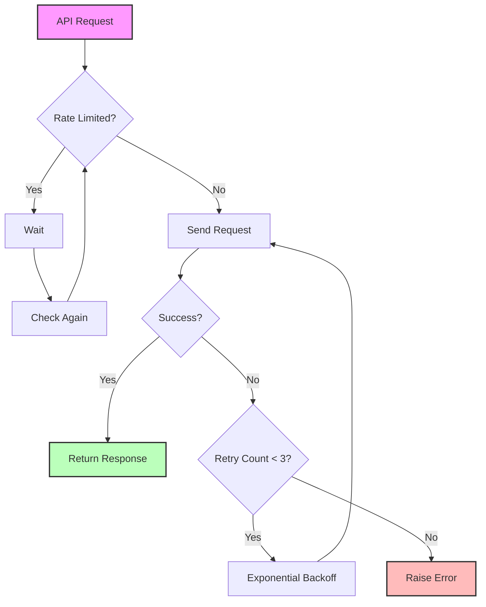

# Document Analyzer

A  document analysis tool that uses Google's Gemini AI to process and summarize documents content in short summary.

## Table of Contents
- [Installation](#installation)
- [Usage](#usage)
- [Architecture](#architecture)
  - [High-Level Overview](#high-level-overview)
  - [Component Architecture](#component-architecture)
  - [Data Flow](#data-flow)
  - [Key Workflows](#key-workflows)
- [Technical Details](#technical-details)

## Installation

### Prerequisites
- Python 3.10 or higher
- Windows OS (for the included start script)

### Quick Start
1. Clone the repository
2. Run `start.bat` which will:
   - Create a Python virtual environment
   - Install required dependencies
   - Start the application

### Manual Installation
1. Create a virtual environment:
```bash
python -m venv venv
```

2. Activate the virtual environment:
```bash
# Windows
venv\Scripts\activate
# Linux/Mac
source venv/bin/activate
```

3. Install dependencies:
```bash
pip install -r requirements.txt
```

4. Configure your API key:
   - Copy `config/example.config.json` to `config/config.json`
   - Replace `YOUR_API_KEY_HERE` with your Google Gemini API key

5. Run the application:
```bash
python src/main.py
```

## Usage

1. Launch the application
2. Enter your Google Gemini API key (or it will be loaded if previously saved)
3. Select a DOCX file for analysis
4. Click "Analyze" to start the process
5. Monitor progress in the UI
6. View the generated summary when processing completes

## Architecture

### High-Level Overview



### Component Architecture



### Data Flow



### Key Workflows

#### Document Processing Workflow



#### API Request Handling



## Technical Details

### Components

1. **UI Handler (`ui_handler.py`)**
   - Manages the graphical user interface
   - Handles user interactions
   - Coordinates between components
   - Displays progress and results

2. **Document Processor (`document_processor.py`)**
   - Reads DOCX files
   - Extracts text content
   - Splits text into manageable chunks
   - Handles text preprocessing

3. **Summarization Engine (`summarization_engine.py`)**
   - Manages the summarization workflow
   - Processes text chunks concurrently
   - Aggregates chunk summaries
   - Generates final summary

4. **Gemini API Client (`api_client.py`)**
   - Handles communication with Google's Gemini API
   - Manages rate limiting
   - Implements retry logic
   - Handles streaming responses

5. **Storage Handler (`storage_handler.py`)**
   - Manages configuration storage
   - Handles API key persistence
   - Loads and saves settings

### Configuration

The application uses a JSON configuration file (`config/config.json`) with the following structure:

```json
{
    "api_key": "YOUR_API_KEY_HERE",
    "model_settings": {
        "model": "gemini-pro",
        "temperature": 0.7,
        "max_output_tokens": 2048,
        "top_p": 0.8,
        "top_k": 40,
        "rate_limit": {
            "requests_per_minute": 15,
            "minimum_delay": 4
        }
    },
    "chunk_settings": {
        "max_chunk_size": 4000,
        "overlap": 200
    }
}
```

### Error Handling

The application implements comprehensive error handling:
- API rate limiting and retries
- File access errors
- Configuration errors
- Processing errors

### Logging

Detailed logging is implemented throughout the application:
- Separate log files for different severity levels
- Rotation of log files
- Request ID tracking
- Performance metrics
- Debug information

### Threading

The application uses threading to:
- Keep UI responsive during processing
- Process chunks concurrently
- Handle API rate limiting
- Manage progress updates 
